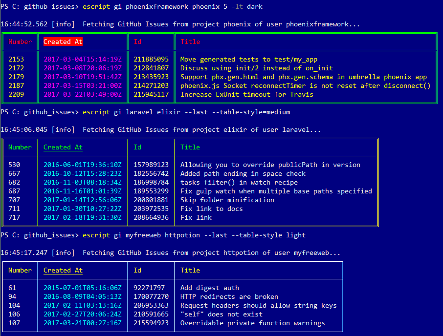

# GitHub Issues

Prints GitHub Issues to STDOUT in a table with borders and colors.

## Using

To use `Github Issues`, first clone it from GitHub:

  - git clone https://github.com/RaymondLoranger/github_issues

Then run these commands to build the escript:

  - cd github_issues
  - chcp 65001 (if you are on Windows)
  - mix deps.get
  - mix escript.build

Now you can run the application like so for example:

  - escript gi --help
  - escript gi elixir-lang elixir 9 --last --table-style=dark

N.B. The escript is named `gi` for _**g**_ithub _**i**_ssues.

## Example

escript gi elixir-lang elixir 9 --last --table-style=dark

## 
