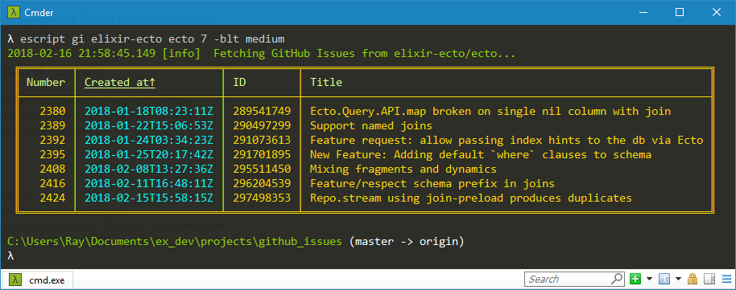
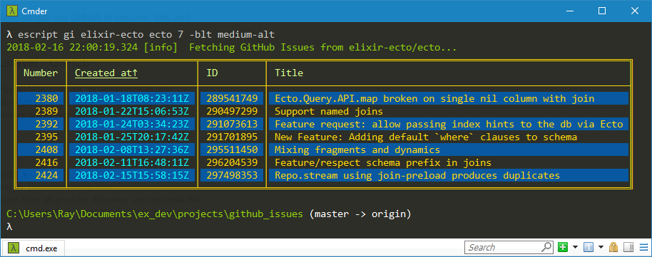
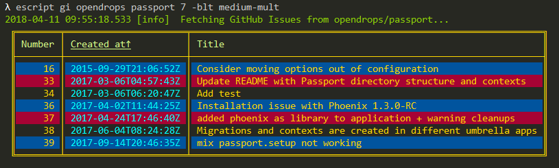
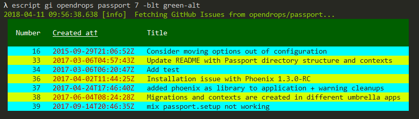
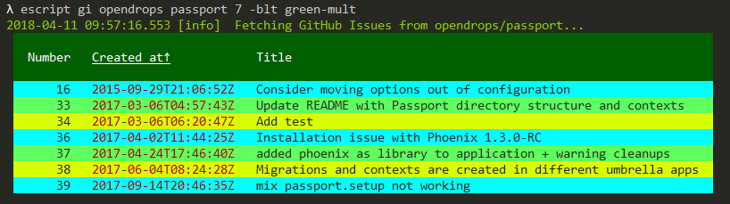

# GitHub Issues

Writes GitHub Issues to `:stdio` in a table with borders and colors.

##### Inspired by the book [Programming Elixir](https://pragprog.com/book/elixir16/programming-elixir-1-6) by Dave Thomas.

## Usage

To use `GitHub Issues` locally, run these commands:

```
git clone https://github.com/RaymondLoranger/github_issues
cd github_issues
mix deps.get
mix escript.build
mix escript.install
```

You can now run the application like so:

```
gi --help
gi elixir-lang elixir 9 -blt dark
gi elixir-lang elixir 9 --last --table-style=dark
```

## Examples
## 
## 
## 
## 
## 
